# Netzplantechnik nach DIN 69900 (Knotenvorgangsmodell)

**Projekt:** IT-Ausstattung Planungs- und Konstruktionsbüro  
**Kunde:** VektorPlan GmbH  
**Auftragnehmer:** NextLevel IT Solutions GmbH  
**Projektleiter:** Jan Kluth  

---

## 1. Übersicht & Berechnungsmethode

Zur exakten Termin- und Pufferanalyse wurde ein Netzplan nach **DIN 69900** auf Basis der Vorgangsliste aufgestellt. 

> **Interaktive Datei:**  
> Die vollständige Zeitanalyse mit Vorwärts-, Rückwärtsrechnung und Pufferermittlung ist in der Excel-Tabelle hinterlegt:  
> 📊 **[`Netzplan.xlsx`](file:///C:/Users/erolt/Desktop/projekt_handlungsaufgabe/docs/01_Projektorganisation/Netzplan.xlsx)**

### Aufbau der Vorgangsknoten (Standard-Schema)

```
┌───────────────────────────────────────────────┐
│ FAZ (Frühester Anfang)  │ FEZ (Frühestes Ende)│
├───────────────────────────────────────────────┤
│ Vorgangs-Nr. │ Vorgangsname                   │
├───────────────────────────────────────────────┤
│ Dauer (Tage) │ GP (Gesamtpuffer) │ FP (Frei)  │
├───────────────────────────────────────────────┤
│ SAZ (Spätester Anfang)  │ SEZ (Spätestes Ende)│
└───────────────────────────────────────────────┘
```

---

## 2. Grafischer Netzplan (Ablauf & Kritischer Weg)

Die rote Markierung (**===**) kennzeichnet den **kritischen Pfad** (Gesamtpuffer = 0). Eine Verzögerung auf diesem Pfad führt unmittelbar zu einer Projektverzögerung.

```mermaid
graph LR
    classDef crit fill:#FCE4D6,stroke:#C00000,stroke-width:3px,color:#9C0006;
    classDef norm fill:#EDF2F8,stroke:#005A9C,stroke-width:1.5px,color:#002B49;

    V1["<b>V1: Projektstart</b><br/>Dauer: 2 T | FAZ: 0 / FEZ: 2<br/>SAZ: 0 / SEZ: 2 | GP: 0"]:::crit
    V2["<b>V2: Lastenheft</b><br/>Dauer: 5 T | FAZ: 2 / FEZ: 7<br/>SAZ: 2 / SEZ: 7 | GP: 0"]:::crit
    V3["<b>V3: Marktrecherche</b><br/>Dauer: 5 T | FAZ: 7 / FEZ: 12<br/>SAZ: 7 / SEZ: 12 | GP: 0"]:::crit
    V4["<b>V4: Nutzwertanalyse</b><br/>Dauer: 3 T | FAZ: 12 / FEZ: 15<br/>SAZ: 12 / SEZ: 15 | GP: 0"]:::crit
    V5["<b>V5: Angebot & Kalkulation</b><br/>Dauer: 4 T | FAZ: 15 / FEZ: 19<br/>SAZ: 15 / SEZ: 19 | GP: 0"]:::crit
    V6["<b>V6: Kundenfreigabe</b><br/>Dauer: 3 T | FAZ: 19 / FEZ: 22<br/>SAZ: 19 / SEZ: 22 | GP: 0"]:::crit
    V7["<b>V7: Beschaffung</b><br/>Dauer: 10 T | FAZ: 22 / FEZ: 32<br/>SAZ: 22 / SEZ: 32 | GP: 0"]:::crit
    V8["<b>V8: Wareneingang § 377</b><br/>Dauer: 2 T | FAZ: 32 / FEZ: 34<br/>SAZ: 32 / SEZ: 34 | GP: 0"]:::crit
    V9["<b>V9: Vorinstallation</b><br/>Dauer: 5 T | FAZ: 34 / FEZ: 39<br/>SAZ: 34 / SEZ: 39 | GP: 0"]:::crit

    V10["<b>V10: Altdrucker Entsorgung</b><br/>Dauer: 2 T | FAZ: 39 / FEZ: 41<br/>SAZ: 40 / SEZ: 42 | GP: 1"]:::norm
    V11["<b>V11: Montage vor Ort</b><br/>Dauer: 3 T | FAZ: 39 / FEZ: 42<br/>SAZ: 39 / SEZ: 42 | GP: 0"]:::crit

    V12["<b>V12: Funktionstest & Abnahme</b><br/>Dauer: 2 T | FAZ: 42 / FEZ: 44<br/>SAZ: 42 / SEZ: 44 | GP: 0"]:::crit
    V13["<b>V13: Übergabe & Doku</b><br/>Dauer: 1 T | FAZ: 44 / FEZ: 45<br/>SAZ: 44 / SEZ: 45 | GP: 0"]:::crit
    V14["<b>V14: Lessons Learned</b><br/>Dauer: 1 T | FAZ: 45 / FEZ: 46<br/>SAZ: 45 / SEZ: 46 | GP: 0"]:::crit

    V1 ==> V2
    V2 ==> V3
    V3 ==> V4
    V4 ==> V5
    V5 ==> V6
    V6 ==> V7
    V7 ==> V8
    V8 ==> V9

    V9 -->|Parallel| V10
    V9 ==>|Kritisch| V11

    V10 --> V12
    V11 ==> V12

    V12 ==> V13
    V13 ==> V14
```



---

## 3. Zeitanalyse-Tabelle

| Nr. | Vorgang | Dauer | Vorgänger | Nachfolger | FAZ | FEZ | SAZ | SEZ | Gesamtpuffer | Kritisch? |
|---|---|:---:|:---:|:---:|:---:|:---:|:---:|:---:|:---:|:---:|
| **1** | Projektstart & Kick-off | 2 | - | 2 | 0 | 2 | 0 | 2 | 0 | **JA** |
| **2** | Anforderungsanalyse & Lastenheft | 5 | 1 | 3 | 2 | 7 | 2 | 7 | 0 | **JA** |
| **3** | Marktrecherche & Produktauswahl | 5 | 2 | 4 | 7 | 12 | 7 | 12 | 0 | **JA** |
| **4** | Nutzwertanalyse | 3 | 3 | 5 | 12 | 15 | 12 | 15 | 0 | **JA** |
| **5** | Angebotserstellung & Kalkulation | 4 | 4 | 6 | 15 | 19 | 15 | 19 | 0 | **JA** |
| **6** | Kundenfreigabe abwarten | 3 | 5 | 7 | 19 | 22 | 19 | 22 | 0 | **JA** |
| **7** | Bestellung & Beschaffung | 10 | 6 | 8 | 22 | 32 | 22 | 32 | 0 | **JA** |
| **8** | Wareneingang & Prüfung (§ 377 HGB) | 2 | 7 | 9 | 32 | 34 | 32 | 34 | 0 | **JA** |
| **9** | Vorinstallation & Staging | 5 | 8 | 10, 11 | 34 | 39 | 34 | 39 | 0 | **JA** |
| 10 | Entsorgung Altdrucker (ElektroG) | 2 | 9 | 12 | 39 | 41 | 40 | 42 | **1** | Nein |
| **11** | Lieferung & Montage vor Ort | 3 | 9 | 12 | 39 | 42 | 39 | 42 | 0 | **JA** |
| **12** | Funktionstest & Abnahme | 2 | 10, 11 | 13 | 42 | 44 | 42 | 44 | 0 | **JA** |
| **13** | Übergabe & Dokumentation | 1 | 12 | 14 | 44 | 45 | 44 | 45 | 0 | **JA** |
| **14** | Projektabschluss & Lessons Learned | 1 | 13 | - | 45 | 46 | 45 | 46 | 0 | **JA** |

**Ergebnis:**  
- **Gesamte Projektdauer:** **46 Arbeitstage**  
- **Kritischer Weg:** `1 ➔ 2 ➔ 3 ➔ 4 ➔ 5 ➔ 6 ➔ 7 ➔ 8 ➔ 9 ➔ 11 ➔ 12 ➔ 13 ➔ 14`  
- **Puffer:** Lediglich der Vorgang 10 (Altdrucker-Entsorgung) hat 1 Tag Gesamtpuffer, da die Vor-Ort-Montage (V11) 3 Tage dauert und beide vor dem Funktionstest (V12) abgeschlossen sein müssen.
