# Projektstrukturplan (PSP) nach DIN 69901

**Projekt:** IT-Ausstattung Planungs- und Konstruktionsbüro  
**Kunde:** VektorPlan GmbH  
**Auftragnehmer:** NextLevel IT Solutions GmbH  
**Projektleiter:** Jan Kluth  

---

## 1. Übersicht & Vorgehensweise

Der Projektstrukturplan (PSP) gliedert das Gesamtprojekt in plan- und kontrollierbare Teilaufgaben und Arbeitspakete (APs) nach dem **objekt- und phasenorientierten Ansatz** (DIN 69901).

> **Hinweis zur Dokumentation:**  
> Der detaillierte, tabellarische Projektstrukturplan mit allen Arbeitspaketen, Verantwortlichkeiten, Teampartnern und konkreten Abnahmeergebnissen ist zusätzlich in der Excel-Tabelle hinterlegt:  
> 📊 **[`Projektstrukturplan.xlsx`](file:///C:/Users/erolt/Desktop/projekt_handlungsaufgabe/docs/01_Projektorganisation/Projektstrukturplan.xlsx)**

---

## 2. Grafischer Projektstrukturplan (Mermaid-Diagramm)

```mermaid
graph TD
    classDef root fill:#002B49,stroke:#001726,stroke-width:2px,color:#fff;
    classDef main fill:#005A9C,stroke:#003366,stroke-width:2px,color:#fff;
    classDef sub fill:#E8F1F5,stroke:#005A9C,stroke-width:1px,color:#1A202C;

    A["1.0 Projekt VektorPlan IT-Ausstattung<br/>(Projektleitung: Jan Kluth)"]:::root

    A --> B["1.1 Hardware-Ausstattung<br/>(Marian Bolecke)"]:::main
    A --> C["1.2 Software & Lizenzen<br/>(Mathias Vonau)"]:::main
    A --> D["1.3 Netzwerk & Server<br/>(Siyar)"]:::main
    A --> E["1.4 Qualitätsmanagement<br/>(Marco Schmidt)"]:::main
    A --> F["1.5 Rollout & Übergabe<br/>(Mathias Vonau)"]:::main
    A --> G["1.6 Projektmanagement<br/>(Jan Kluth)"]:::main

    B --> B1["1.1.1 12x Standard-PCs"]:::sub
    B --> B2["1.1.2 4x CAD-Workstations"]:::sub
    B --> B3["1.1.3 32x WQHD Monitore"]:::sub
    B --> B4["1.1.4 16x Funk Tastatur/Maus"]:::sub
    B --> B5["1.1.5 16x Externe SSDs"]:::sub
    B --> B6["1.1.6 1x Farblaser A3 MFP"]:::sub

    C --> C1["1.2.1 16x Windows 11 Pro"]:::sub
    C --> C2["1.2.2 16x M365 Business"]:::sub
    C --> C3["1.2.3 16x Adobe Acrobat Pro"]:::sub
    C --> C4["1.2.4 16x ESET PROTECT EDR"]:::sub

    D --> D1["1.3.1 16x Cat.6A Patchkabel"]:::sub
    D --> D2["1.3.2 Fileserver (445 GiB)"]:::sub
    D --> D3["1.3.3 Energiekosten-Analyse"]:::sub

    E --> E1["1.4.1 Wareneingang § 377 HGB"]:::sub
    E --> E2["1.4.2 Mängelrüge & Gewährl."]:::sub
    E --> E3["1.4.3 Altdrucker-Entsorgung"]:::sub

    F --> F1["1.5.1 Staging / Vorinstall."]:::sub
    F --> F2["1.5.2 Montage vor Ort (ArbStättV)"]:::sub
    F --> F3["1.5.3 Funktionstests / End-to-End"]:::sub
    F --> F4["1.5.4 Abnahmeprotokoll"]:::sub

    G --> G1["1.6.1 Ablaufplan & Gantt (48 T.)"]:::sub
    G --> G2["1.6.2 Risikoanalyse (7 Risiken)"]:::sub
    G --> G3["1.6.3 Kalkulation & Angebot"]:::sub
    G --> G4["1.6.4 Abschluss & Präsentation"]:::sub
```

---

## 3. Kodierung & Arbeitspakete (Auszug)

| PSP-Code | Element | Ebene | Verantwortlich | Teampartner | Liefergegenstand / Ergebnis |
|---|---|---|---|---|---|
| **1.0** | Projekt: IT-Ausstattung VektorPlan | 1 | Jan Kluth | Gesamtes Team | Schlüsselfertige Übergabe von 16 Arbeitsplätzen |
| **1.1** | Hardware-Ausstattung | 2 | Marian Bolecke | Mathias Vonau | Geprüfte & beschaffte Hardware |
| 1.1.1 | 12x Standard-Büro-PCs | 3 | Marian Bolecke | Mathias Vonau | Lenovo ThinkCentre M70s Gen 4 (SFF, leise) |
| 1.1.2 | 4x CAD/BIM-Workstations | 3 | Marian Bolecke | Mathias Vonau | Lenovo ThinkStation P3 Tower (RTX 4000 Ada) |
| 1.1.3 | 32x Ergonomische Monitore | 3 | Marian Bolecke | Marco Schmidt | Dell UltraSharp U2724D (WQHD, IPS, Pivot) |
| 1.1.4 | 16x Eingabegeräte-Sets | 3 | Marian Bolecke | Siyar | Logitech MK650 Signature Business (AES) |
| 1.1.5 | 16x Externe SSDs | 3 | Marian Bolecke | Siyar | Samsung Portable SSD T7 Shield 1TB |
| 1.1.6 | 1x A3/A4 MFP-Drucker | 3 | Marian Bolecke | Mathias Vonau | Lexmark CX930dse Farb-Multifunktionsdrucker |
| **1.2** | Software & Lizenzierung | 2 | Mathias Vonau | Siyar | Lizenziertes Softwarepaket |
| 1.2.1 | Betriebssysteme | 3 | Mathias Vonau | Siyar | 16x Windows 11 Pro 64-Bit OEM |
| 1.2.2 | Office & Produktivität | 3 | Mathias Vonau | Jan Kluth | 16x Microsoft 365 Business Standard |
| 1.2.3 | PDF-Bearbeitung | 3 | Mathias Vonau | Jan Kluth | 16x Adobe Acrobat Pro für Teams |
| 1.2.4 | Endpoint Protection & EDR | 3 | Mathias Vonau | Marco Schmidt | 16x ESET PROTECT Entry Cloud Security |
| **1.3** | Netzwerkanbindung & Kapazität | 2 | Siyar | Mathias Vonau | Messprotokolle & Serverauslegung |
| 1.3.1 | Gigabit-LAN Verkabelung | 3 | Siyar | Mathias Vonau | 16x InLine Cat.6A S/FTP Patchkabel (3m) |
| 1.3.2 | Fileserver-Kapazitätsberechnung | 3 | Siyar | Jan Kluth | 445 GiB Speicherbedarf inkl. 25% Puffer |
| 1.3.3 | Energiekosten-Kalkulation | 3 | Siyar | Marian Bolecke | Jahreskosten: 1.771,26 € (2.960 W Gesamtlast) |
| **1.4** | Qualitätsmanagement & Logistik | 2 | Marco Schmidt | Marian Bolecke | Vollständige Prüf- & Rechtsdokumentation |
| 1.4.1 | Wareneingangsprüfung § 377 HGB | 3 | Marco Schmidt | Marian Bolecke | Prüfbericht & Checklisten |
| 1.4.2 | Mängelrüge & Distributorenkorrespondenz | 3 | Marco Schmidt | Jan Kluth | Fristgerechtes Rüge-Schreiben (Gehäuse & Monitor) |
| 1.4.3 | Altdrucker-Entsorgung | 3 | Marco Schmidt | Siyar | Entsorgungsnachweis gem. ElektroG & WEEE |
| **1.5** | Rollout, Montage & Übergabe | 2 | Mathias Vonau | Gesamtes Team | Abgenommene Arbeitsplätze vor Ort |
| 1.5.1 | Staging & Vorinstallation | 3 | Mathias Vonau | Siyar | Image-Deployment & Domänenintegration |
| 1.5.2 | Montage vor Ort & Ergonomie | 3 | Mathias Vonau | Marian Bolecke | Aufbau nach ArbStättV & Kabelmanagement |
| 1.5.3 | Funktionstests & End-to-End Test | 3 | Mathias Vonau | Marco Schmidt | Testprotokoll (Netzwerk, CAD, MFP-Druck) |
| 1.5.4 | Abnahme & Übergabeprotokoll | 3 | Jan Kluth | Mathias Vonau | Unterzeichnetes Abnahmeprotokoll |
| **1.6** | Projektmanagement & Abschluss | 2 | Jan Kluth | Gesamtes Team | Einhaltung von Zeit, Budget und Qualität |
| 1.6.1 | Ablauf- & Terminplanung | 3 | Jan Kluth | Marian Bolecke | 48-Tage-Ablaufplan (Vorgangsliste & Gantt) |
| 1.6.2 | Risikomanagement | 3 | Jan Kluth | Marco Schmidt | Risikomatrix mit 7 bewerteten Risiken |
| 1.6.3 | Kaufmännische Angebotskalkulation | 3 | Marian Bolecke | Jan Kluth | Vorwärtskalkulation & DIN 5008 Angebot |
| 1.6.4 | Projektabschluss & Präsentation | 3 | Jan Kluth | Gesamtes Team | Lessons Learned & 14-Folien-Abschlusspräsentation |
