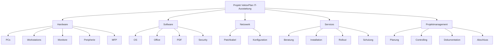

# Projektstrukturplan

```mermaid
graph TD
    A[Projekt VektorPlan IT-Ausstattung]
    
    A --> B[Hardware]
    A --> C[Software]
    A --> D[Netzwerk]
    A --> E[Services]
    A --> F[Projektmanagement]
    
    B --> B1[PCs]
    B --> B2[Workstations]
    B --> B3[Monitore]
    B --> B4[Peripherie]
    B --> B5[MFP]
    
    C --> C1[OS]
    C --> C2[Office]
    C --> C3[PDF]
    C --> C4[Security]
    
    D --> D1[Patchkabel]
    D --> D2[Konfiguration]
    
    E --> E1[Beratung]
    E --> E2[Installation]
    E --> E3[Rollout]
    E --> E4[Schulung]
    
    F --> F1[Planung]
    F --> F2[Controlling]
    F --> F3[Dokumentation]
    F --> F4[Abschluss]
```
